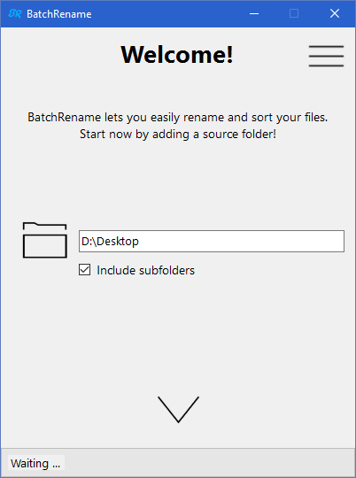
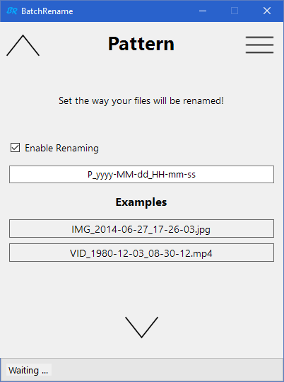
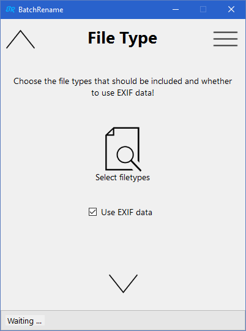
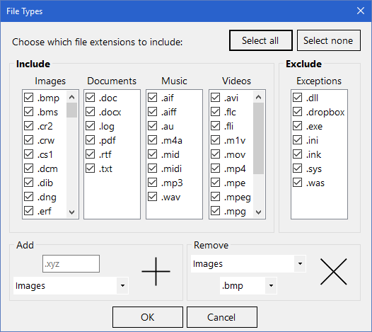
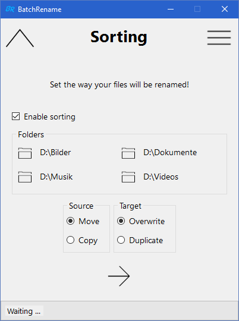
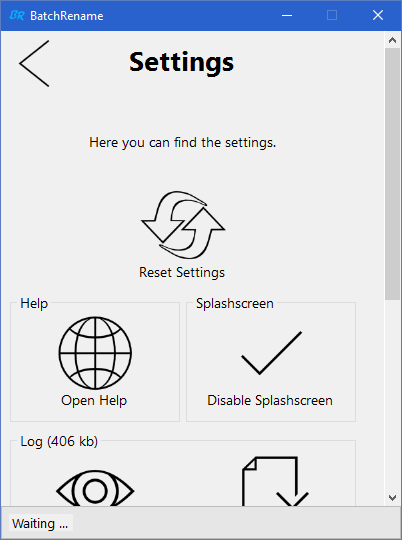
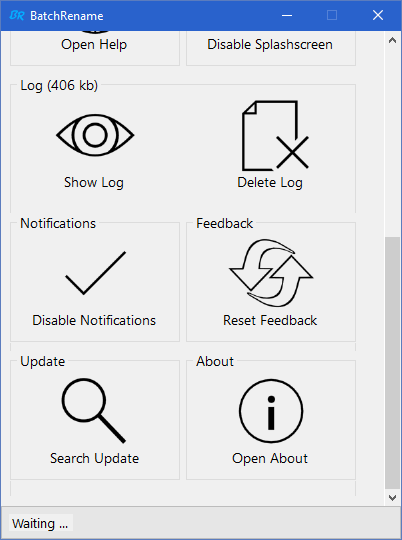
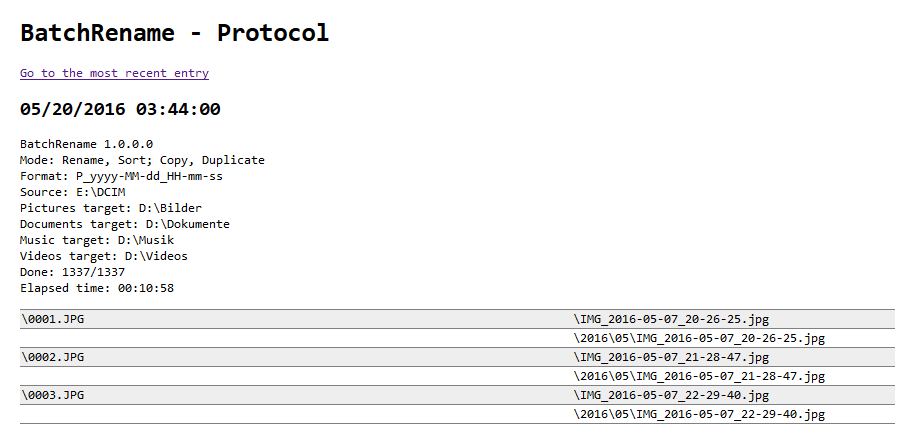

# BatchRename
With this application you can rename and sort large amounts of photos and other files at once using a specific pattern.
It is especially useful for photos with stored *EXIF data*. For example, you can move the file `Camera-Uploads\0024.jpg` to `2015\06\2015-06-25_12-34-02.jpg` automatically!

## Download
See [Releases](https://github.com/dargmuesli/batch-rename/releases "Releases").

**Attention:** You may get a Windows Smartscreen warning as this program is not signed with a certificate from a certificate authority.

## Current features

### Renaming
- By using EXIF data
- By using the last file change timestamp
- Customizable pattern
  - Example output preview

### Sorting
- By using EXIF data
- By using the last file change timestamp
- Both with a fixed pattern (`/year/month/`)
- Copy or move files
- Overwrite or duplicate files

### Other
- Comprehensive file compatibility
  - Pictures
  - Documents
  - Music
  - Videos
- *Zoner Photo Studio* backup file support
- Progress indicator
- Automatic updates

## Future Features
- Customizable sorting pattern

See [Issues](https://github.com/dargmuesli/batch-rename/issues).

# Screenshots

